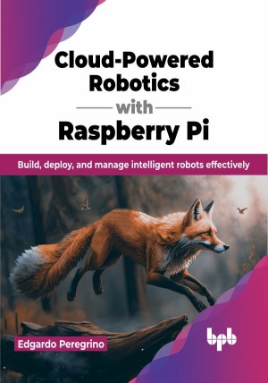

# Cloud-Powered Robotics with Raspberry Pi

Learn how to use cloud native tools for robotics

This is the repository for [Cloud-Powered Robotics with Raspberry Pi
](https://bpbonline.com/products/cloud-powered-robotics-with-raspberry-pi?_pos=1&_sid=652ce8998&_ss=r&variant=43023085633736),published by BPB Publications.

## About the Book
Embrace the transformative power of cloud robotics with Cloud-Powered Robotics with Raspberry Pi, your ultimate guide to building and deploying intelligent robotic applications using cutting-edge DevOps and cloud native tools. Immerse yourself in the fundamentals of DevOps, mastering the principles and practices that streamline software development and deployment. Uncover the intricacies of cloud native tools like Docker and Kubernetes, learning how to containerize, orchestrate, and manage your robotic applications with unparalleled efficiency.

Transform your knowledge into action by constructing a comprehensive robot monitoring system step by step. Through this hands-on project, you will gain practical experience with cloud native tools, solidifying your understanding of their applications and empowering you to leverage their capabilities for your own projects.
Explore the boundless potential of cloud native computing in robotics, discovering how these tools are revolutionizing industries like assembly, farming, and medicine. Gain insights from real-world case studies, witnessing how small companies are harnessing the power of cloud native tools to create innovative robotic solutions.

Join the forefront of cloud robotics and empower yourself to build, deploy, and monitor intelligent robotic applications that transform industries and shape the future.

## What You Will Learn
• Learn the basics of DevOps and Cloud Native Computing.

•  Learn how to use cloud native tools by building a robot monitoring application.

•  Learn how each tool works and understand the concepts of cloud native computing along the way. 

•  Specific examples of how to use cloud native tools in other fields such as assembly, farming and medicine.

